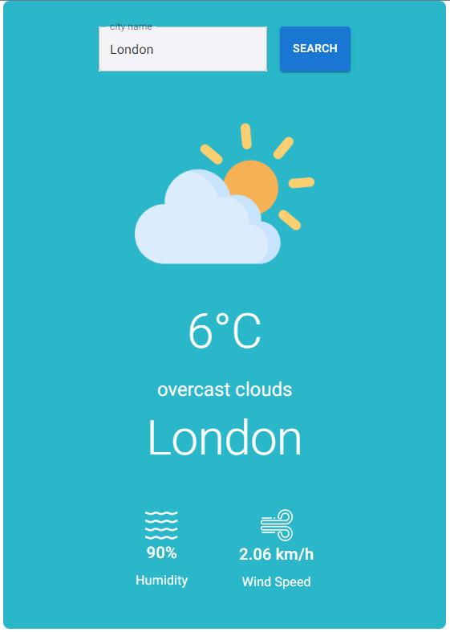

# Weather App
Weather app is a simple app that shows the current weather in a given location. The app uses the OpenWeatherMap API to get the weather data. The app is built using React, Vite, and Material-UI.


 



## How to use

Download the example [or clone the whole project]

```bash
git clone https://github.com/AvrahamOhana/react-vite-mui-template.git
cd react-vite-mui-template
```

Install it and run:

```bash
npm install
npm run dev
```